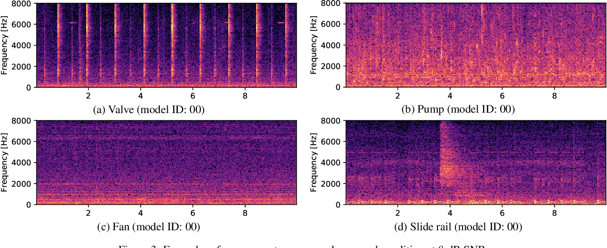

<h1 align="center"> <strong>Mechanical_Breakdown_Prediction</strong> </h1>

|  |
|:-:|

- Type of challenge: Learning
- Duration: `2 weeks`
- Deadline : `02/04/2021 09:00 AM`
- Team challenge: Group project
- Contributers: Regis Schulze & Joren Vervoort

---

## **Table of Contents**
Your section headers will be used to reference the location of the destination.

- [Description](#description)
- [How To Use](#how-to-use)
- [Repo Artitecture](#repo-artitecture)
- [Next Step](#next-step)
- [Author Info](#author-info)

## **Description**

### *Mission Objectives*
Acme Corporation is a worldwide supplier of technological equipment. The factory is facing significant problems with their manufacturing line, the machines are constantly facing failures due to a lack of maintenance and the production is stopped every time an unexpected failure is presented. As a result, Acme is losing millions of U.S Dollars and important clients like Wile E. Coyote are experiencing delays in deliveries. 

The company has collected audio samples of equipment working on normal and anomalous conditions. Their objective is to develop a machine learning model able to monitor the operations and identify anomalies in the sound pattern.

The implementation of this model can allow Acme to operate the manufacturing equipment at full capacity and detect signs of failure before the damage is so critical that the production line has to be stopped.

Your mission is to build a machine learning model for Acme so they can continue their manufacturing activities.

### *Learning Objectives*

- Be able to work and process data from audio format
- Find insights from data, build hypothesis and define conclusions
- Build machine learning models for predictive classification and/or regression
- Select the right performance metrics for your model
- Evaluate the distribution of datapoints and evaluate its influence in the model
- Be able to identify underfitting or overfitting that might exist on the model

### **Technologies**
<br/>

| Library           | Used to                                        |
| ----------------  | :----------------------------------------------|
| pandas            | To handle dataframes                           |
| numpy             | To handle arrays                               |
| matplotlib        | To plot graphs                                 |
| scikit-learn      | Used to construct machine learning models      |
| imbalanced-learn  | ML models for imbalanced datasets              |
| librosa           | To handle .wav files                           |
| pickleshare       | To save trained ML models                      |


[**↥ Back To The Top**](#table-of-contents)

## **How To Use**

### **Installation** 

`Python Ver. '3.7'`

1. Open terminal `cmd`
2. Install the required libraries  `pip install -r requiement.txt`
3. Download the dataset from [this link](https://zenodo.org/record/3384388#.YMsGz_LiuUk)
4. Run the app.py python script `python main.py`

[**↥ Back To The Top**](#table-of-contents)

---

## **Repo Artitecture**
```
Mechanical_Breakdown_Prediction
│   README.md                     :explains the project
│   requirements.txt              :packages to install to run the program
│   main.py                       :file that contains all the main script for program
└───utils                         :director that contains all functions used in the main script
│   │
│   |───feature_and_model_selection.py                    :selecting the needed features from the data to train a ML model                        
│   │───preprocessing.py                                  :preparation of the data
└───images                        :folder containing images for the README.md
│   │
│   |───sound_waves.png.                                  :image of soundwaves
└───data                         :director that contains all functions used in the main script
│   │
│   |───created_csv_files                    :selecting the needed features from the data to train a ML model
│   |   |───Librosa_features_fan_-6dB.csv              :.csv file of features of sound recordings of a fan with noise added at -6dB
│   |   |───Librosa_features_fan_0dB.csv               :.csv file of features of sound recordings of a fan with noise added at 0dB
│   |   └───Librosa_features_fan_6dB.csv               :.csv file of features of sound recordings of a fan with noise added at 6dB
│   |   |───Librosa_features_pump_-6dB.csv             :.csv file of features of sound recordings of a pump with noise added at -6dB
│   |   |───Librosa_features_pump_0dB.csv              :.csv file of features of sound recordings of a pump with noise added at 0dB
│   |   └───Librosa_features_pump_6dB.csv              :.csv file of features of sound recordings of a pump with noise added at 6dB
│   |   |───Librosa_features_slider_-6dB.csv           :.csv file of features of sound recordings of a slider with noise added at -6dB
│   |   |───Librosa_features_slider_0dB.csv            :.csv file of features of sound recordings of a slider with noise added at 0dB
│   |   └───Librosa_features_slider_6dB.csv            :.csv file of features of sound recordings of a slider with noise added at 6dB
│   |   |───Librosa_features_valve_-6dB.csv            :.csv file of features of sound recordings of a valve with noise added at -6dB
│   |   |───Librosa_features_valve_0dB.csv             :.csv file of features of sound recordings of a valve with noise added at 0dB
│   |   └───Librosa_features_valve_6dB.csv             :.csv file of features of sound recordings of a valve with noise added at 6dB
│   │───wav_files                               :folder to store the downloaded dataset
└───saved_models                         :director that contains all the models that you train with the script


```

[**↥ Back To The Top**](#table-of-contents)

---

## **Result Preview**

If you run the script and run it to train your ML models and let them make a prediction on a .wav file, the model will either say "The machine is running normal." or ""The machine needs maintenance"".

[**↥ Back To The Top**](#table-of-contents)

---

## **Next Step**

- Automate downloading and process
- Add a visual aspects and deploy it

[**↥ Back To The Top**](#table-of-contents)

## **Authors Info**

- Linkedin - [Joren Vervoort](https://www.linkedin.com/in/vervoort-joren/)
- Github - [Joren Vervoort](https://github.com/Joren-Vervoort)

[**↥ Back To The Top**](#table-of-contents)

## **Thank you for reading.**
